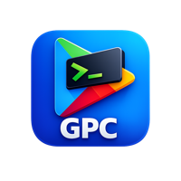
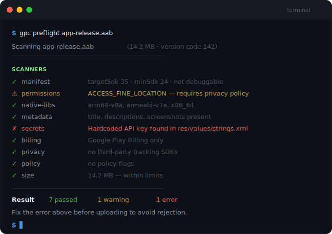

<p align="center">
  
</p>

# GPC — Google Play Console CLI

<p align="center">
  <a href="https://www.npmjs.com/package/@gpc-cli/cli"></a>
  <a href="https://github.com/yasserstudio/gpc/stargazers"></a>
  
  
  
  <a href="https://www.npmjs.com/package/@gpc-cli/cli"></a>
  <a href="https://yasserstudio.github.io/gpc/"></a>
  
  
</p>

<p align="center"><strong>Ship Android apps from your terminal.</strong></p>

<p align="center"><sub>Built for Android developers, vibe coders, release engineers, DevOps teams — and iOS developers who have no idea how the Play Console works.</sub></p>

<p align="center">
The complete CLI for Google Play — 187 API endpoints, one tool.<br>
Releases, rollouts, metadata, vitals, reviews, subscriptions, reports, and more.<br>
<strong>Plus an offline compliance scanner that catches policy violations before you upload.</strong><br>
Free and open-source. MIT licensed.
</p>

<p align="center">
  
</p>

---

## Install

```bash
# npm (includes plugin support)
npm install -g @gpc-cli/cli

# Homebrew (macOS/Linux)
brew install yasserstudio/tap/gpc

# Standalone binary (no Node.js required)
curl -fsSL https://raw.githubusercontent.com/yasserstudio/gpc/main/scripts/install.sh | sh
```

Free. Open-source. No account required beyond your existing Google Play service account.

---

## Why GPC?

You shouldn't need a browser to ship your app.

Every Android release is the same ritual: open the Play Console, upload your AAB, copy-paste release notes, pick a track, set the rollout percentage, click through confirmation screens. Fifteen minutes of clicking. Every single time.

The alternative? Install Ruby, Bundler, and 150+ gems to run Fastlane — and get access to maybe 20 of 187 API endpoints. No reviews. No vitals. No subscriptions. No reports.

GPC covers the **entire Google Play Developer API** in one CLI — that's 187 endpoints, nothing left out. No Ruby. No browser. No ceremony.

### GPC vs the alternatives

|                     | **GPC**                      | Fastlane supply | gradle-play-publisher | Console UI   |
| ------------------- | ---------------------------- | --------------- | --------------------- | ------------ |
| API coverage        | **187 endpoints**            | ~20             | ~15                   | All (manual) |
| Runtime             | Node.js or standalone binary | Ruby + Bundler  | JVM                   | Browser      |
| Cold start          | <500ms                       | 2-3s            | 3-5s                  | 5-10s        |
| Reviews & Vitals    | Yes                          | No              | No                    | Yes (manual) |
| Subscriptions & IAP | Yes                          | No              | No                    | Yes (manual) |
| CI/CD native        | JSON + exit codes + env vars | Partial         | Gradle tasks          | No           |
| Plugin system       | Yes                          | No              | No                    | No           |
| Interactive mode    | Yes (guided prompts)         | No              | No                    | N/A          |
| Preflight scanner   | **9 offline policy scanners**| No              | No                    | No           |
| Test suite          | 1,737 tests, 90%+ coverage   | —               | —                     | —            |

Already on Fastlane? See the [migration guide](https://yasserstudio.github.io/gpc/migration/from-fastlane) — most commands map one-to-one.

---

## Quick Start

```bash
# Authenticate
gpc auth login --service-account path/to/key.json

# Verify your setup
gpc doctor

# App health at a glance — releases, vitals, and reviews in one command
gpc status

# Upload and release
gpc releases upload app.aab --track internal

# Promote to production with staged rollout
gpc releases promote --from internal --to production --rollout 10

# Monitor reviews
gpc reviews list --stars 1-3 --since 7d
```

---

## What You Can Do

### Preflight compliance scanner

**No other tool does this.** Scan your AAB against Google Play policies before uploading — entirely offline, no API calls, no bundletool, no Java. Catches issues that would cause rejection or extended review.

```bash
gpc preflight app.aab                                      # Run all 9 scanners
gpc preflight app.aab --fail-on error --json               # CI quality gate (exit code 6)
gpc preflight manifest app.aab                             # Target SDK, debuggable, exported
gpc preflight permissions app.aab                          # 18 restricted permissions audit
gpc preflight metadata fastlane/metadata/android           # Store listing compliance
gpc preflight codescan app/src                             # Secrets, billing SDKs, tracking
```

9 scanners run in parallel: **manifest** (target SDK, debuggable, testOnly, cleartext, exported, foreground service types), **permissions** (18 restricted permissions with policy URLs), **native-libs** (64-bit compliance), **metadata** (listing limits, screenshots, privacy policy), **secrets** (AWS, Google, Stripe keys), **billing** (non-Play SDKs), **privacy** (tracking SDKs, Advertising ID), **policy** (Families/COPPA, financial, health, UGC), **size** (download warnings). Configure with `.preflightrc.json`.

<p align="center">
  
</p>

### Ship releases

From first upload to full production rollout — in one pipeline, without touching a browser.

```bash
gpc publish app.aab --track beta --notes "Bug fixes"      # End-to-end flow
gpc releases upload app.aab --track internal               # Upload to any track
gpc releases promote --from beta --to production --rollout 5
gpc releases promote --from beta --to production --copy-notes-from beta
gpc releases rollout increase --track production --to 50
gpc releases rollout halt --track production               # Emergency brake
gpc releases count                                         # Release stats per track
gpc validate app.aab --track beta                          # Pre-submission checks
```

### Monitor app health

Know if something broke before your users do.

```bash
gpc status                                 # Releases + vitals + reviews in one view
gpc status --threshold crashes=1.5,anr=0.5 # One-off threshold overrides
gpc status --review-days 14               # Custom reviews window (default 30)
gpc status --watch 60                      # Live polling with elapsed time footer
gpc vitals crashes --threshold 2.0         # Exit code 6 if breached — CI gates
gpc vitals compare crashes --days 7        # This week vs last week
```

### Manage store listings

Keep your store presence in sync — pull, edit locally, push. Works with Fastlane metadata format.

```bash
gpc listings pull --dir metadata/          # Download all listings
gpc listings push --dir metadata/          # Upload local changes (Fastlane format)
gpc listings images upload --lang en-US --type phoneScreenshots ./screens/*.png
```

### Track reviews

Stay on top of what users are saying — filter, reply, and export without leaving your terminal.

```bash
gpc reviews list --stars 1-2 --since 7d
gpc reviews reply <review-id> "Thanks for the feedback!"
gpc reviews export --format csv --output reviews.csv
```

### Handle monetization

Manage subscriptions and IAP without digging through the Play Console UI.

```bash
gpc subscriptions list
gpc subscriptions create --file subscription.json
gpc iap list
gpc iap sync --dir products/
gpc pricing convert --from USD --amount 9.99
```

### Analyze bundle size

Catch size regressions before they ship.

```bash
gpc bundle analyze app.aab                   # Per-module + per-category breakdown
gpc bundle compare old.aab new.aab           # Size diff between builds
gpc bundle analyze app.aab --threshold 150   # Exit code 6 if > 150 MB — CI gate
```

### Manage testers and users

```bash
gpc testers add user@example.com --track internal
gpc testers import --track beta --file testers.csv
gpc users list --developer-id <id>
```

### Project setup

Bootstrap a new project with config, metadata directories, and CI templates in one command.

```bash
gpc init                              # Interactive — prompts for package name and CI
gpc init --app com.example.app        # Non-interactive
gpc init --app com.example.app --ci-template github  # Include GitHub Actions workflow
```

### Preview before publishing

See what's live and what would change — without mutating anything.

```bash
gpc diff                                        # Release status across all tracks
gpc diff --from internal --to production        # Compare two tracks
gpc diff --metadata fastlane/metadata/android   # Local vs remote listings
```

See the full [command reference](https://yasserstudio.github.io/gpc/commands/) for all 187 endpoints — including reports, purchases, data safety, device tiers, internal sharing, external transactions, and recovery actions.

---

## CI/CD

Drop GPC into any pipeline. JSON output, semantic exit codes (0–6), env var config — no wrapper scripts needed.

### GitHub Actions

```yaml
- name: Install GPC
  run: npm install -g @gpc-cli/cli

- name: Preflight Compliance Check
  run: gpc preflight app.aab --fail-on error

- name: Upload to Internal Track
  env:
    GPC_SERVICE_ACCOUNT: ${{ secrets.GPC_SERVICE_ACCOUNT }}
    GPC_APP: com.example.myapp
  run: gpc releases upload app.aab --track internal

- name: Gate on Vitals
  run: |
    gpc vitals crashes --output json | jq -e '.data.crashRate < 2.0'
```

### GitLab CI

```yaml
deploy:
  image: node:20
  script:
    - npm install -g @gpc-cli/cli
    - gpc releases upload app.aab --track production --rollout 10
  variables:
    GPC_SERVICE_ACCOUNT: $GPC_SERVICE_ACCOUNT
    GPC_APP: com.example.myapp
```

Add `@gpc-cli/plugin-ci` for automatic GitHub Actions step summaries.

See the full [CI/CD recipes](https://yasserstudio.github.io/gpc/ci-cd/) for GitHub Actions, GitLab CI, Bitbucket Pipelines, and CircleCI.

---

## Developer Experience

- **Smart output** — formatted tables in your terminal, structured JSON when piped or in CI. Override with `--output json|yaml|markdown`.
- **Dry run everything** — every write command supports `--dry-run`. Run your full pipeline against real data without publishing a thing.
- **Interactive prompts** — miss a required flag and GPC asks. In CI, it fails fast instead — never hangs waiting for input. Disable with `--no-interactive`.
- **Four auth methods** — service account, OAuth, env var, or Application Default Credentials. Works with your existing Google Play service account.
- **Multiple accounts** — `gpc auth profiles`, `gpc auth switch`, `gpc auth whoami`.

---

## Packages (CLI + SDK)

GPC is a TypeScript monorepo. Use the CLI from your terminal, or import the SDK into your own projects — same API client, same auth, same reliability.

Need to integrate Play data into your own tools? Build custom dashboards, Slack bots, or internal release portals on top of the same client GPC uses:

```typescript
import { createApiClient } from "@gpc-cli/api";
import { resolveAuth } from "@gpc-cli/auth";

const auth = await resolveAuth({
  serviceAccount: "./service-account.json",
});
const client = createApiClient({ auth });

const releases = await client.tracks.list("com.example.app");
const vitals = await client.vitals.overview("com.example.app");
```

CLI for your terminal. SDK for everything else.

| Package                                                                    | Description                                  |
| -------------------------------------------------------------------------- | -------------------------------------------- |
| [`@gpc-cli/cli`](https://www.npmjs.com/package/@gpc-cli/cli)               | CLI entry point — the `gpc` command          |
| [`@gpc-cli/core`](https://www.npmjs.com/package/@gpc-cli/core)             | Business logic and command orchestration     |
| [`@gpc-cli/api`](https://www.npmjs.com/package/@gpc-cli/api)               | Typed Google Play Developer API v3 client    |
| [`@gpc-cli/auth`](https://www.npmjs.com/package/@gpc-cli/auth)             | Authentication (service account, OAuth, ADC) |
| [`@gpc-cli/config`](https://www.npmjs.com/package/@gpc-cli/config)         | Configuration loading and profiles           |
| [`@gpc-cli/plugin-sdk`](https://www.npmjs.com/package/@gpc-cli/plugin-sdk) | Plugin interface for extensions              |
| [`@gpc-cli/plugin-ci`](https://www.npmjs.com/package/@gpc-cli/plugin-ci)   | CI/CD helpers and step summaries             |

---

## Environment Variables

| Variable              | Description                                 | Default                       |
| --------------------- | ------------------------------------------- | ----------------------------- |
| `GPC_SERVICE_ACCOUNT` | Service account JSON string or file path    | —                             |
| `GPC_APP`             | Default package name                        | —                             |
| `GPC_PROFILE`         | Auth profile name                           | —                             |
| `GPC_OUTPUT`          | Default output format                       | `table` (TTY) / `json` (pipe) |
| `GPC_NO_COLOR`        | Disable color output (`GPC_NO_COLOR=1`)     | —                             |
| `GPC_DEBUG`           | Enable verbose debug output (`GPC_DEBUG=1`) | —                             |
| `GPC_NO_INTERACTIVE`  | Disable prompts (auto in CI)                | —                             |
| `GPC_MAX_RETRIES`     | Max retry attempts                          | `3`                           |
| `GPC_TIMEOUT`         | Request timeout (ms)                        | `30000`                       |

---

## Exit Codes

Every exit code is documented — your CI knows exactly what happened and why:

| Code | Meaning                               |
| ---- | ------------------------------------- |
| `0`  | Success                               |
| `1`  | General error                         |
| `2`  | Usage error (bad arguments)           |
| `3`  | Authentication error                  |
| `4`  | API error (rate limit, permission)    |
| `5`  | Network error                         |
| `6`  | Threshold breach (vitals CI alerting) |
| `10` | Plugin error                          |

---

## Documentation

Full documentation at **[yasserstudio.github.io/gpc](https://yasserstudio.github.io/gpc/)** — full command reference, CI/CD recipes, and migration guides.

- [Installation](https://yasserstudio.github.io/gpc/guide/installation)
- [Quick Start](https://yasserstudio.github.io/gpc/guide/quick-start)
- [Commands Reference](https://yasserstudio.github.io/gpc/commands/)
- [CI/CD Recipes](https://yasserstudio.github.io/gpc/ci-cd/)
- [Architecture](https://yasserstudio.github.io/gpc/advanced/architecture)
- [Plugin Development](https://yasserstudio.github.io/gpc/advanced/plugins)
- [Security](https://yasserstudio.github.io/gpc/advanced/security)
- [Migration from Fastlane](https://yasserstudio.github.io/gpc/migration/from-fastlane)

---

## Get Help

- [GitHub Discussions](https://github.com/yasserstudio/gpc/discussions) — questions, ideas, show what you built
- [Issues](https://github.com/yasserstudio/gpc/issues) — bug reports and feature requests
- `gpc doctor` — diagnose setup problems locally

---

## Contributing

Found a bug? Want to add a feature? Read the [setup guide](./CONTRIBUTING.md) and jump in — first-time setup takes about 10 minutes.

```bash
git clone https://github.com/yasserstudio/gpc.git
cd gpc
pnpm install
pnpm build
pnpm test    # 1,737 tests across 7 packages
```

---

## License

[MIT](./LICENSE)

---

## Star History

[](https://star-history.com/#yasserstudio/gpc&Date)

---

<p align="center">
  <sub>GPC is an independent, open-source project. Not affiliated with, endorsed by, or sponsored by Google LLC. "Google Play" and the Google Play logo are trademarks of Google LLC. "Android" and "Google" are trademarks of Google LLC.</sub>
</p>
